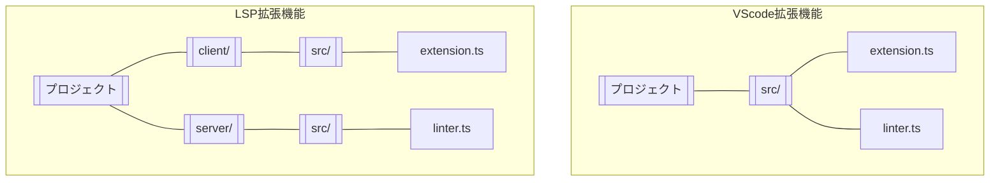

# LSP（Langage Server Protocol）

|LSPとは |
|:-|

様々なエディタで同一の機能を提供する規格。Vim,Atom,VScodeで同じ機能が使えるということ。

```mermaid

graph 

subgraph VScode拡張機能
direction LR

    A1[[プロジェクト]]---A2[[src/]];
    A2[[src/]]---A3[extension.ts];
    A2[[src/]]---A4[linter.ts];

end

subgraph LSP拡張機能
direction LR

    B1[[プロジェクト]]---B2[client/];
    B2[[client/]]---B3[src/];
    B3[[src/]]---B4[extension.ts];
    B1[[プロジェクト]]---C1[server/];
    C1[[server/]]---C2[[src/]];
    C2[[src/]]---C3[linter.ts];

end

```

